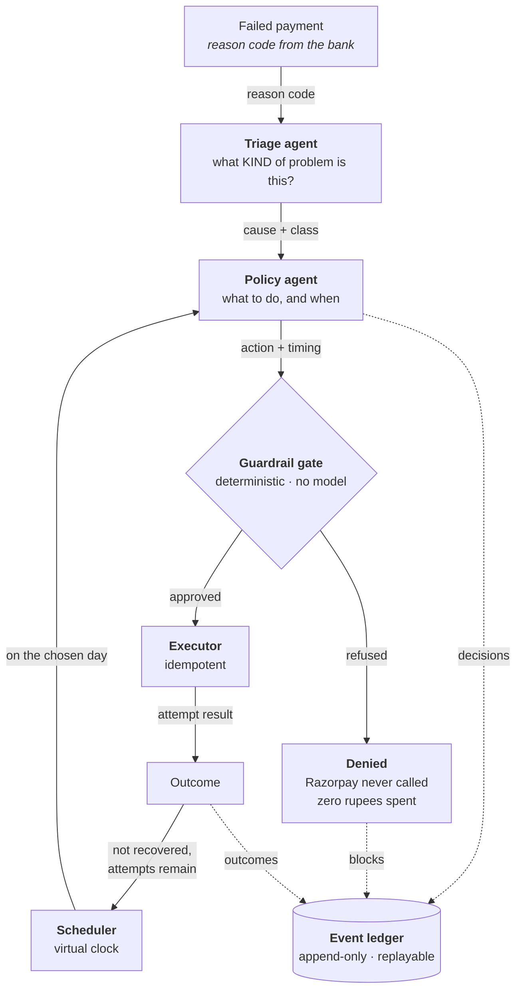
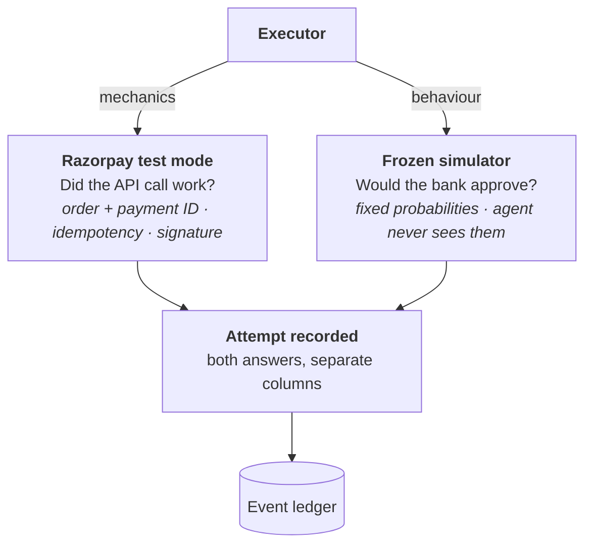

# Winback — Architecture

An autonomous agent that recovers failed payments: how it is put together, where the
intelligence sits, and which parts are deliberately not intelligent at all.

---

## The one idea everything follows from

When Winback attempts a recovery, **two entirely different questions** have to be
answered, and they are answered by two different systems.

> **Razorpay test mode** answers *"did the API call work?"*
> **The frozen simulator** answers *"would the customer's bank have approved it?"*

The first proves the integration is real. The second makes the measurement honest.

Build only the first and you have a system that runs but proves nothing. Build only the
second and you have a simulation with nothing real underneath. Collapse them into one
`status` field and you lose the ability to say *"the integration worked and the customer
still would not have paid"* — which is a real and common outcome, and one the results
table depends on being able to express.

Every design decision below follows from keeping those two apart.

---

## How one failed payment moves



Three properties of this loop are worth stating explicitly, because they are what a
payments engineer will look for.

**The gate sits before the executor, not inside it.** A denial costs zero API calls and
zero rupees. The policy engine has no network client and no side effects, so a refusal
*cannot* already have cost the merchant a gateway fee. That is the difference between a
system that refuses and one that apologises.

**The loop passes through a scheduler, not a retry counter.** Every decision carries a
date. "Retry" and "retry on the 7th" are different plans, and only the second one is
worth anything on an insufficient-funds failure.

**The ledger is append-only.** No row is ever updated. Any transaction's full history is
reconstructed from its events alone, which is what makes the replay view trustworthy —
it is the record itself, read back in order, not a summary written afterwards.

---

## Where an attempt's outcome comes from



A replayed attempt therefore reads:

```
→ day 12  retry_scheduled  order order_TU5YNI6OCgZkyD  api ok (razorpay)  bank declined  p=0.492
```

The integration worked. The customer still would not have paid. Two facts, two columns.

### Why the simulator cannot be removed

There are 400 synthetic customers and none of them has a bank account. Razorpay test mode
returns whatever outcome the sandbox is configured to return — so using it as the verdict
would be *more* dishonest, not less: it would look like reality while still being a number
the author chose.

So the rules of the world were written down **before any strategy code existed**, frozen,
git-tagged `simulator-frozen-v1`, and published in full in
[`simulation/assumptions.yaml`](../simulation/assumptions.yaml) with a justification per
number. The agent never imports that module.

`simulation/` sits **outside** `backend/` for exactly this reason: it is not part of the
product, it is the instrument the product is measured with.

---

## Where the model is, and where it is not

| The model decides | Fixed code decides |
|---|---|
| What kind of failure this is *(structured output, schema-validated)* | Attempt caps, cooldowns, quiet hours, DND |
| The ambiguous declines, against customer history | Mandate validity |
| Wording of customer messages *(not yet built)* | Timing arithmetic and the payday calendar |
| Human-readable explanations | Idempotency and duplicate suppression |
| | Stopping rules and the abandon threshold |
| | **The amount** — snapshotted at failure, never recomputed |

**For 14 of the 16 reason codes, no model is called at all.** `card_expired` means the
card expired; there is nothing a language model can add and everything for it to get
wrong. The model is consulted only where the lookup table genuinely cannot decide — the
two ambiguous codes, and any code never seen before.

```
decided by lookup table   325 (81% of transactions, zero model cost)
escalated to the model     75 (19%)
```

Spending intelligence only where it changes the answer is the whole trick. It also means
**81% of the batch has no model attack surface at all.**

### The model is optional, on purpose

A model provider having a bad afternoon must not stop a merchant recovering money.

`LiveClient` never raises. A 403, a timeout, malformed JSON — each is recorded, the
validation layer substitutes the conservative default, and that transaction is decided by
rules instead. After three consecutive failures the circuit opens and no further calls are
attempted, because 400 doomed HTTP requests help nobody. The run then reports the
degradation rather than hiding it.

This is only survivable *because* of the tiering: the rule tier is a complete strategy on
its own, so losing the model costs about a percent of recovery rather than the run.

---

## Defence in depth

Winback spends money and contacts people autonomously, so hostile input is a design
input, not an afterthought. Free text on a customer account is **evidence, never an
instruction**.

Four layers, each of which fails differently:

1. **Don't ask.** 81% of decisions never reach a model, so 81% of the batch cannot be
   influenced by anything written on the account.
2. **Detect.** Pattern-match known injection shapes across six attack classes.
3. **Wrap.** Fence untrusted text and label it as data *before* the model sees it.
4. **Constrain.** Allowlist the model's output.

**Only the fourth is load-bearing.** Detection can be evaded by a phrasing nobody has
seen; wrapping can be escaped by a clever delimiter. Allowlisting cannot be talked
around, because it never reads the text at all — it simply refuses to return anything
that was not already on the list.

The investigator may return exactly one of three values: `retry_scheduled`,
`offer_alternate_method`, `abandon`. It does not choose the amount, the number of
attempts, or the hour. **A fully compromised model produces, at worst, a slightly
suboptimal but perfectly safe decision.**

And behind all four sits the policy engine, which does not know the model exists.

The dataset ships 19 hostile notes sitting inside ordinary records, so these defences are
exercised on every single run rather than only when someone remembers the attack script.

---

## The policy engine

Eight rules, **one function each**, in
[`backend/policy/rules.py`](../backend/policy/rules.py). Splitting them out means every
limit is independently readable, independently testable, and impossible to disable by
accident while editing another.

| Rule | Refuses |
|---|---|
| `MANDATE_INVALID` | Any charge against an expired or revoked mandate |
| `AMOUNT_TAMPERED` | Any amount other than the one snapshotted at failure |
| `WINDOW_EXPIRED` | Anything past the 21-day recovery window |
| `CHARGE_CAP` | A fourth charge attempt |
| `CONTACT_CAP` | A fourth message |
| `COOLDOWN` | A second charge inside the minimum gap |
| `DND` | SMS, voice or WhatsApp to a DND-registered customer *(email stays available — DND does not cover it, and over-blocking is a bug too)* |
| `QUIET_HOURS` | Any message between 21:00 and 09:00 |

Rules run in order, most absolute first, so the reported reason is the most fundamental
one rather than whichever happened to be evaluated.

`policy/` sits outside `agents/` on purpose: **guardrails are not something the agent
participates in.**

---

## Time

Recovery plays out over days: retry after payday, nudge after 48 hours, give up at day
21. Real cron makes that impossible to demonstrate — you would be filming a screen where
nothing happens for a fortnight.

So time is a number the scheduler owns and advances. Each tick is a simulated day. A
21-day campaign across 400 transactions completes in well under a second, which means the
eval harness can run a hundred campaigns in CI and there is **no Celery, no Redis and no
worker process** to build, debug or explain.

One deliberate constraint: **the agent reads the clock, it cannot set it.** An agent able
to move time could grant itself an extra retry window.

---

## Exactly once

Idempotency keys are **derived from content, never generated randomly**:

```
sha256(txn_id | attempt_index | action | day | amount)
```

A random key regenerated on retry defeats the entire purpose — the retry would look like
a brand-new attempt. Deriving it means the same logical attempt always produces the same
key, however many times the process crashes and restarts.

**Over-suppression is a bug too.** A different day, amount or action must produce a
different key, or a genuine second attempt gets silently swallowed. Both directions are
tested.

When transport fails we do **not** know whether the charge landed, so nothing is recorded
and nothing is cached — the same key is re-presented the following day rather than a new
attempt being invented. That is the difference between a retry and a double charge.

---

## Data model

| Table | Holds | Key columns |
|---|---|---|
| `customers` | Who we may contact and how | `contact_prefs`, `dnd_flag`, `payday`, `history` |
| `transactions` | The failed payment itself | `amount`, `reason_code`, `source`, `failed_at`, `mandate_id` |
| `decisions` | What the agent chose and why | `tier`, `action`, `scheduled_for`, `rationale`, `tokens`, `cost` |
| `attempts` | What was actually executed | `idempotency_key`, `rp_order_id`, `api_result`, `sim_outcome` |
| `policy_blocks` | What was refused, and by which rule | `rule`, `attempted_action`, `reason`, `tick` |
| `events` | Append-only stream of all of the above | `ts`, `tick`, `txn_id`, `type`, `payload` |

Two columns carry the design. `decisions.tier` records whether a rule or a model made
each call, which is what lets cost be reported per tier. And `attempts` stores
`api_result` and `sim_outcome` **side by side** — the two-layer split, made legible in
the schema itself.

SQLite rather than Postgres so the whole system runs with no external services. The schema
moves to Postgres unchanged.

---

## Provenance: nothing is ever silently substituted

The rule is *not* "everything must hit the network". Routing all ~2,350 charge attempts
through Razorpay means thousands of serial HTTPS round trips — ten minutes of wall clock,
a hammered sandbox, and no information the first fifty calls did not already give.

So integration and measurement are separate questions with separate commands:

| Question | Command | Why |
|---|---|---|
| Does the executor really talk to Razorpay? | `live_proof` | Five real calls prove it as well as two thousand |
| Which strategy decides better? | `harness` | Has nothing to do with transport |

**Every attempt records which kind of call it was**, and every run reports the split:

```
provenance of this run
  gateway calls        243 via transport double, 0 live
  bank approval        MODELLED by the frozen simulator
```

The console header reads the same measured value, not the configuration — so it can never
claim more real integration than it performed. There is a test asserting exactly that.

---

## Layout

```
simulation/            the measuring instrument — FROZEN, outside the product
  assumptions.yaml     every probability, with its justification
  random_draw.py       common random numbers
  simulator.py         the world's verdict on one attempt

backend/
  config/              env · secrets · status · mode
  domain/              failure_classes · reason_codes · classification
                       actions · playbook · calendar · models
  security/            attack_classes · detectors · screening · wrapping
  llm/                 base · live_client · scripted_client · validation · factory
  agents/              triage_agent · investigator_agent
  policy/              limits · plan · rules · engine
  scheduler/           clock · job_queue · campaign
  executor/            idempotency · gateway_base · razorpay_gateway
                       fake_gateway · sampling_gateway · gateway_factory · executor
  ledger/              event_types · store · replay
  strategies/          one file per strategy, plus registry
  data/                reason_mix · profiles · generator · summary
  evaluation/          cost_model · result · scoring · reporting
                       runner · harness · sensitivity · provenance · live_proof
  attacks/             model · policy · execution · false_positives · suite
  api/                 app + one file per route group

frontend/              index.html · 3 stylesheets · 11 scripts
tests/                 95 tests
```

The structure makes the argument. A reviewer skimming the tree should be able to infer,
without opening a file, that the simulator is not part of the product and that guardrails
are not part of the agent.

---

## Five decisions I would defend

**1. The gate is before the executor.** A denial must cost nothing. Any design where the
refusal happens after the API call is a design where being safe still costs money.

**2. The model classifies and explains; it never authorises.** Every limit is enforced by
code the agent cannot reach. A limit the agent has merely been *told* about is not a
limit — it is a suggestion, and language models can be talked out of suggestions.

**3. The simulator was frozen before the agent was written.** Tuning against your own
measuring instrument is how simulated results become meaningless. The assumptions are
published, fingerprinted, and swept: at payday multiplier 1.0 — timing assumed worthless —
Winback still wins 43.5% to 31.0%.

**4. Common random numbers across strategies.** The random draw for a given (transaction,
attempt) is identical no matter which strategy is asking; only the success threshold
differs. No strategy can get lucky relative to another, and variance between them
collapses.

**5. Giving up is a first-class action.** `ABANDON` is something the policy agent
actively chooses, with a reason, recorded in the ledger. An agent that never stops is a
liability, not a feature — every further attempt costs a gateway fee, issuer trust, and
customer patience.

---

## Known limits

- **Payment authorisation is sandbox-dependent.** Order creation is fully real and
  verified by reading the order back. Authorising the charge needs either a client-side
  checkout or a saved token on a registered mandate; where that is unavailable it is
  recorded as unavailable rather than faked.
- **The 30-day month is a simplification.** Real payday alignment needs a real calendar,
  including weekends and bank holidays.
- **Message copy is not generated.** The system decides *send a nudge* but does not yet
  write the words.
- **The cost model is a guess** — ₹2 per charge attempt, ₹0.30 per message.
  Directionally right, not measured.
- **Winback is disciplined about charges and not yet disciplined about contact.** It
  sends 284 messages, 177 of them on transactions that are never recovered. A message is
  cheap in rupees and expensive in goodwill, and the cost model only prices the former.

---

## What I would build next

**Cost-aware stopping.** The abandon threshold is currently a day count. It should be an
expected-value calculation: stop when the probability of recovery times the amount no
longer exceeds the cost of the next attempt. The system already records everything that
calculation needs.

**Per-merchant learned priors.** The playbook is one table for everyone. A merchant
selling ₹300 subscriptions to students has a different recovery curve from one selling
₹30,000 B2B invoices, and the ledger already holds the evidence to separate them.
